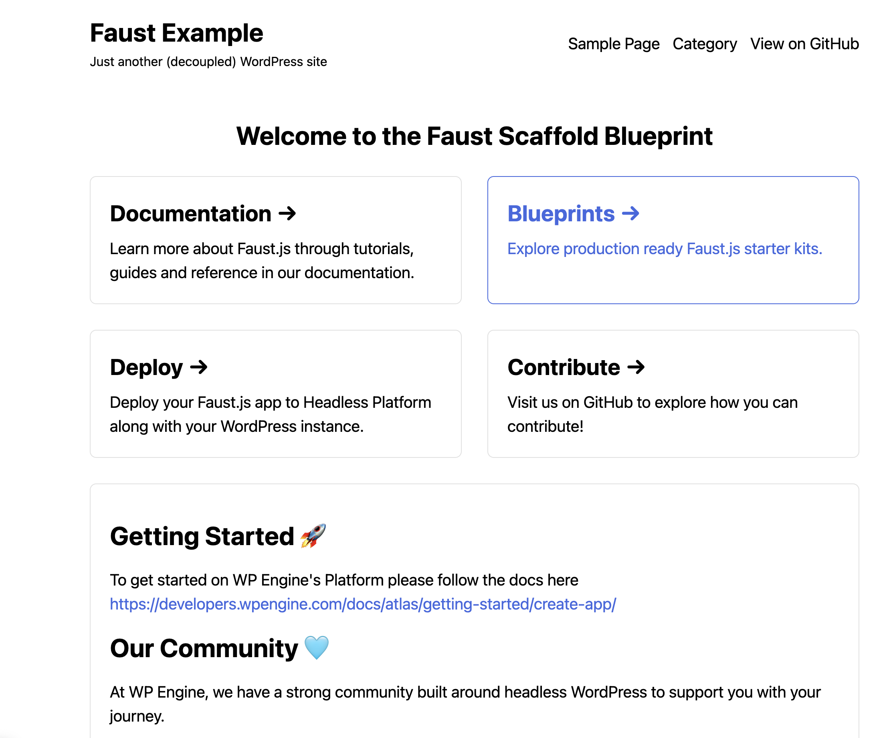
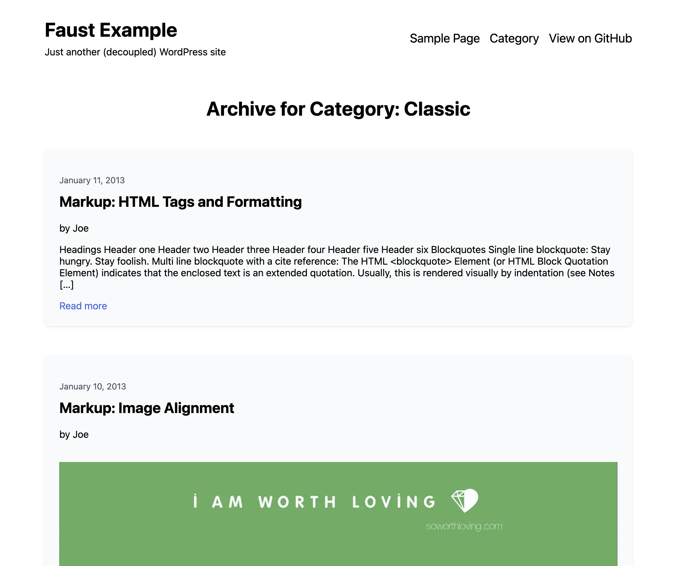
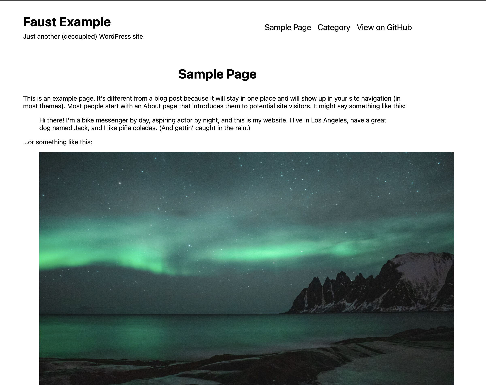
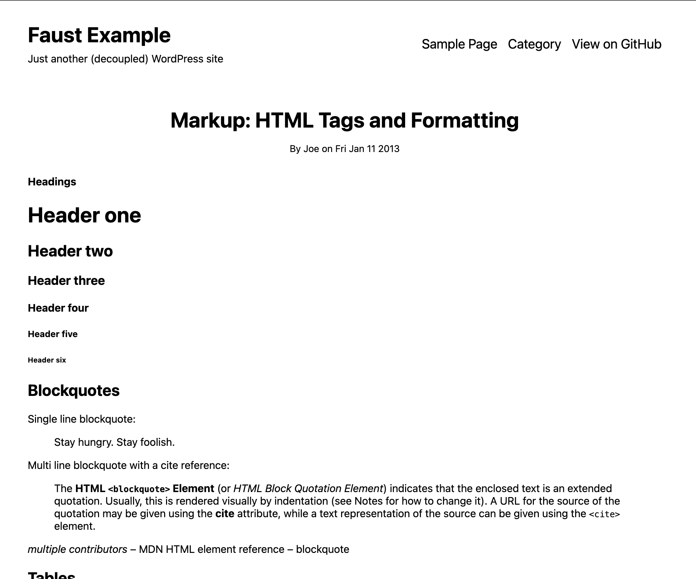

#  Faust.js Starter Kit

This repository contains a starter kit to get you up and running quickly on [WP Engine's Headless Platform](https://wpengine.com/headless-wordpress/) with a WordPress site skeleton for more advanced developers.

## Getting Started 🚀

To get started on WP Engine's Platform please follow the docs here [https://developers.wpengine.com/docs/atlas/getting-started/create-app/](https://developers.wpengine.com/docs/atlas/getting-started/create-app/)

## Project Structure

```bash
├── components/
├── fragments/
├── pages/
├── queries/
├── styles/
├── wp-templates/
│   ├── archive.js          # For your category/archive templates
│   ├── front-page.js       # Front page
│   ├── index.js            # Mapping for available templates
│   ├── page.js             # Single page
│   └── single.js           # Single post or singular
├── DEVELOPMENT.md
├── faust.config.js
├── next.config.js
├── package.json
├── possibleTypes.json
└── README.md
└── screenshots
```

## Available Commands

| Command       | Script                        | Description                      |
| ------------- | ----------------------------- | -------------------------------- |
| `dev`         | `faust dev`                   | Start the development server     |
| `build`       | `faust build`                 | Build the project for production |
| `generate`    | `faust generatePossibleTypes` | Generate GraphQL possible types  |
| `start`       | `faust start`                 | Start the production server      |
| `format`      | `prettier . --write`          | Format code with Prettier        |
| `test:format` | `prettier . --check`          | Check code formatting            |

## Screenshots

<details>
    <summary>View Screenshots</summary>









</details>

## Recent Updates & Implementation Notes 🔧

### Physician Search System Enhancements (October 2025)

#### 🩺 Core Physician Search Features
- **Enhanced GraphQL Queries**: Updated `queries/PhysicianQueries.js` with comprehensive physician search capabilities
- **Specialty-Specific Pages**: Implemented `wp-templates/single-specialty.js` for individual specialty search pages
- **Advanced Search Filtering**: Location-based search with distance calculation, specialty filtering, language preferences, insurance filters, and education-based filtering
- **Pagination System**: Consistent 10 results per page across all search interfaces

#### 🔍 Search Functionality Improvements
- **Specialty Acronym Mapping**: Created `components/specialtySearchUtils.js` with fuzzy search and acronym resolution (e.g., "ENT" → "Otolaryngology")
- **Geolocation Integration**: Auto-populate user location using Google Geocoding API
- **Distance Calculation**: Haversine formula implementation for accurate distance sorting
- **Real-time Autocomplete**: Dynamic specialty suggestions in search forms

#### 🏠 Homepage Search Component (`components/front-page/search-doctor.js`)
- **Smart Parameter Mapping**: Doctor name + Practice name → main search field
- **Location Coordinate Passing**: Geocodes zip codes to provide immediate distance sorting in find-care results
- **Specialty Autocomplete**: Dynamic dropdown with GraphQL-powered specialty suggestions
- **Geolocation Features**: Auto-fill zip code with user's current location

#### 🔧 Technical Implementation Details

##### Location Search Race Condition Fix
Fixed the "flashing results" issue where location searches would initially show unsorted results before displaying distance-sorted results:
- **Root Cause**: Missing coordinate persistence in URL parameters
- **Solution**: Added `searchLat` and `searchLng` parameters to URL during navigation
- **Implementation**: Both `find-care.js` and `single-specialty.js` now use shallow routing with coordinate persistence

##### GraphQL Schema Updates
- **Enhanced Physician Queries**: Support for array-based specialty filtering
- **Location Parameters**: Integrated latitude/longitude for server-side distance filtering
- **Performance Optimization**: Efficient pagination with proper total count handling

##### State Management Improvements
- **URL State Persistence**: All search parameters maintained across navigation
- **Coordinate Restoration**: `useEffect` hooks properly restore location coordinates from URL
- **Error Handling**: Comprehensive error handling for geolocation and API failures

#### 📋 Component Architecture

```
Search System Architecture:
├── pages/find-care.js (Main physician search page)
├── wp-templates/single-specialty.js (Specialty-specific search)
├── components/front-page/search-doctor.js (Homepage search form)
├── components/find-doc/search-form.js (Advanced search form)
├── components/specialtySearchUtils.js (Search utilities)
└── queries/PhysicianQueries.js (GraphQL queries)
```

#### 🔄 Known Issues & Future Improvements

> [!IMPORTANT]
> **Specialty System Refactoring Required**: The current specialty implementation uses ACF (Advanced Custom Fields) for specialty data management. This will need to be refactored once the physician plugin is updated to use a custom post type for specialties instead of ACF fields.

**Planned Changes:**
- Migration from ACF-based specialty system to custom post type
- Enhanced specialty taxonomy with hierarchical relationships
- Improved specialty metadata management
- Better performance through native WordPress post type queries

#### 🧪 Testing Notes
- **Location Search**: Test with various zip codes and international addresses
- **Specialty Search**: Verify acronym mapping and fuzzy search functionality
- **Distance Calculation**: Validate accuracy of distance measurements
- **Cross-Page Navigation**: Ensure URL parameters persist correctly across page transitions

#### 🔧 Environment Dependencies
- **Google Geocoding API**: Required for location-based search functionality
- **WPGraphQL**: Powers all physician and specialty data queries
- **Apollo Client**: Manages GraphQL query caching and state

## Our Community 🩵

At WP Engine, we have a strong community built around headless WordPress to support you with your journey.

- [Discord Headless Community Channel](https://faustjs.org/discord)
- [Fortnightly Headless Community Call](https://discord.gg/headless-wordpress-836253505944813629?event=1371472220592930857)
- [WP Engine's Headless Platform developer community](https://wpengine.com/builders/headless)
- [WP Engine`s Builders YouTube Channel](https://www.youtube.com/@WPEngineBuilders)
- [WP Engine's Headless Platform](https://wpengine.com/headless-wordpress/)
- [WP Engines Headless Platform Docs](https://developers.wpengine.com/docs/atlas/overview/)

## Plugin Ecosystem 🪄

- [Faust.js](https://faustjs.org)
- [WPGraphQL](https://www.wpgraphql.com)
- [WPGraphQL Content Blocks](https://github.com/wpengine/wp-graphql-content-blocks)
- [WPGraphQL IDE](https://github.com/wp-graphql/wpgraphql-ide)
- [HWP Toolkit](https://github.com/wpengine/hwptoolkit)

## Documentation 🔎

> [!NOTE]
> We are continuously adding new docs for [Faustjs.org](https://faustjs.org/docs)

- [Faust.js Documentation](https://faustjs.org/docs/)
- [Headless Platform Documentation](https://wpengine.com/headless-wordpress/)
- [WPGraphQL Documentation](https://developers.wpengine.com/docs/atlas/overview/)


## Contributions

## Contributor License Agreement

All external contributors to WP Engine products must have a signed Contributor License Agreement (CLA) in place before the contribution may be accepted into any WP Engine codebase.

1. [Submit your name and email](https://wpeng.in/cla/)
2. 📝 Sign the CLA emailed to you
3. 📥 Receive copy of signed CLA

❤️ Thank you for helping us fulfill our legal obligations in order to continue empowering builders through headless WordPress.
